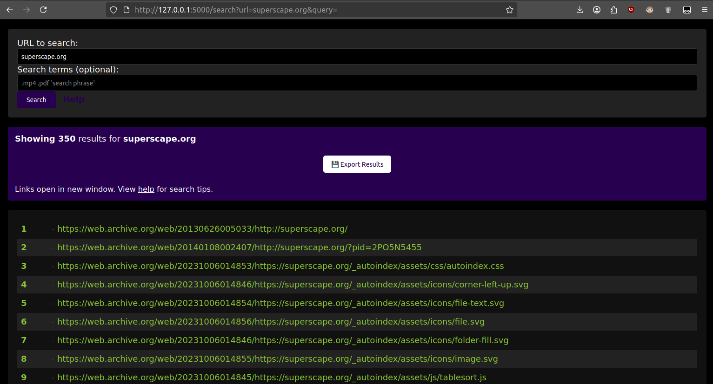
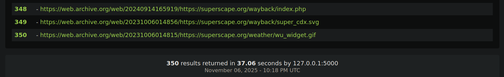

# SuperCDX (a Wayback Machine CDX Search Engine Interface) – Flask Edition

A Flask-based web application for searching files on the Internet Archive's Wayback Machine using the CDX API.  

This is a Flask port of the original PHP Wayback CDX search engine, which ran in production at [superscape.org](https://superscape.org) for 3 years until it became abused. This is why we can't have nice things. Now you can run it locally instead.

Feel free to open issues to help each other, but this app is unsupported by me.

## Screenshots

Below are example screenshots of the application interface:




## Features

- Search domains archived on the Wayback Machine
- Filter results by file types, paths, or keywords
- Support for quoted phrase searches
- Export results to plain text file
- Anti-bot protection via session checking
- Query logging to text file

## Installation

1. Install Python 3.7 or higher

2. Install dependencies:
```bash
pip install -r requirements.txt
```

3. Set a secret key (optional, but recommended for production):
```bash
export SECRET_KEY='your-random-secret-key-here'
```

## Running the Application

### Development Mode

```bash
python app.py
```

The application will be available at `http://localhost:5000`

### Production Mode

For production deployment, use a WSGI server like Gunicorn:

```bash
pip install gunicorn
gunicorn -w 4 -b 0.0.0.0:8000 app:app
```

## Directory Structure

```
.
├── app.py                 # Main Flask application
├── requirements.txt       # Python dependencies
├── logs/
│   └── queries.txt       # Query log file (auto-created)
├── static/
│   ├── css/              # CSS files
│   ├── js/               # JavaScript files
│   └── images/           # Image assets
└── templates/
    ├── base.html         # Base template
    ├── index.html        # Home page
    ├── interface.html    # Search interface
    ├── results.html      # Results page
    ├── help.html         # Help documentation
    └── slow_down.html    # Anti-bot page
```

## Usage

1. Navigate to the home page
2. Enter a domain URL (e.g., `example.com` or `http://www.example.org/`)
3. Optionally add search terms:
   - Single filetype: `.mp4`
   - Multiple filetypes: `.exe .jpg .pdf`
   - Specific filename: `coolfile.html`
   - Path: `/games/`
   - Quoted phrase: `'virtual reality'`
   - Mixed: `/games/ .exe 'virtual reality'`
4. Click search and wait for results
5. Export results using the download button

## Query Logging

All search queries (URLs) are logged to `logs/queries.txt` as single-line entries. No other data is logged.

## Notes

- The application queries the Wayback Machine CDX API which can be slow or unresponsive
- Only returns HTTP 200 status results
- Search is case-insensitive
- Session-based anti-bot protection is enabled by default

## License

This is a Flask port of my original PHP Wayback CDX search engine interface from [superscape.org](https://superscape.org). I have no endorsement from nor affiliation with Archive.org, Wayback Machine or Wayback Machine CDX, etc.
